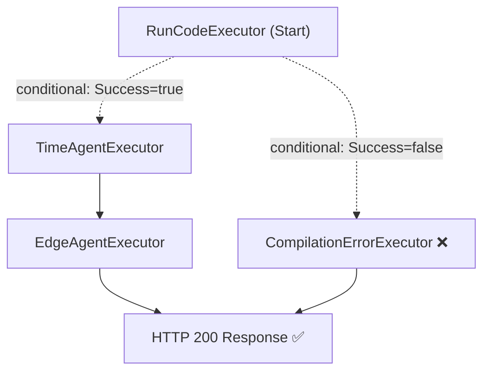

# NGMI — Nonstop Grader of Messy Implementations

Built by Kennedy Nguyen as part of onboarding at LSU CARTS to learn the Microsoft Agent Framework (MAF).

NGMI is a multi-agent code evaluation system that takes a C# code snippet, compiles it, analyzes its time/space complexity, and identifies edge cases where it might fail.

## How It Works

Submissions are processed through a sequential workflow pipeline:



- **RunCodeExecutor** — compiles and runs the snippet using Roslyn. Returns a `CompilationResult` with `Success: true/false`.
- **TimeAgentExecutor** — receives code + execution result, analyzes time/space complexity using RAG context from past analyses.
- **EdgeAgentExecutor** — receives code + complexity analysis, identifies edge cases using RAG context.
- **CompilationErrorExecutor** — fast-fail path for broken code, skips both agents entirely.

## Stack

- .NET 10 / C#
- Microsoft Agent Framework (MAF)
- OpenAI-compatible local model (via appsettings.json)
- Roslyn C# Scripting
- SQLite (analysis history + keyword search for RAG)
- ASP.NET Core Minimal API

## Running It

Start the server:

```
dotnet run
```

Submit a code snippet:

```powershell
Invoke-WebRequest -Method POST -Uri http://localhost:5000/analyze -ContentType "application/json" -Body '{"Code": "public static int Add(int a, int b) { return a + b; }"}'
```

Duplicate submissions are detected and skipped automatically.

## MAF Concepts Covered

- AIAgent with tools (AIFunctionFactory)
- Agent run middleware (logging, guardrails, result override, exception handling)
- IChatClient middleware
- Streaming with RunStreamingAsync
- Sessions and multi-turn conversations
- SQLite persistence
- Workflows with WorkflowBuilder and InProcessExecution
- Conditional edges with typed CompilationResult routing
- CompilationErrorExecutor fast-fail path
- Workflow shared state (QueueStateUpdateAsync / ReadStateAsync)
- Workflow state isolation via CreateWorkflow helper
- Checkpoints with CheckpointManager
- RAG with TextSearchProvider and keyword-based SQLite search
- ASP.NET Core hosting
